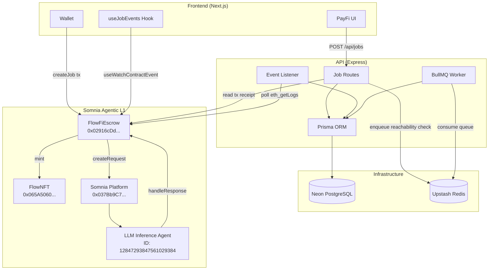
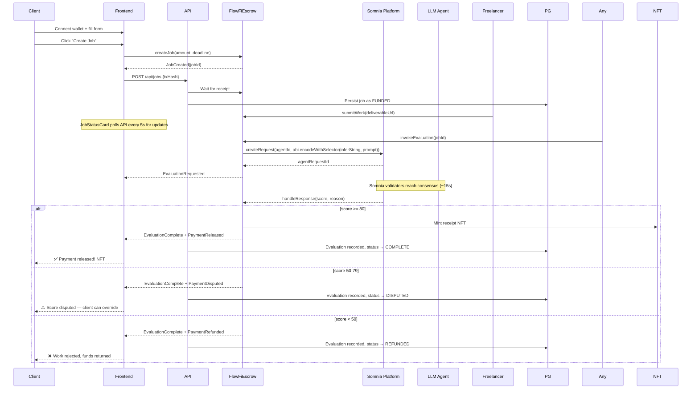

# PayFi PayStream

**AI-gated freelance payment escrow on Somnia Agentic L1.**

An on-chain escrow system where an LLM agent autonomously evaluates completed work and releases payment — no intermediaries, no disputes, no waiting.

---

## Why This Wins the Somnia Agentathon

> *"Most novel and high-impact agent-driven application on Somnia."*

**PayFi is the first production-grade demonstration of Somnia's core thesis: agents are not oracles, not copilots — they are autonomous economic actors with direct on-chain authority.**

Every other DePIN/agent project on Somnia uses agents as **information relays** — reading data, making recommendations, calling webhooks. PayFi gives the agent **direct custody and payment authority** over real value. The LLM agent doesn't "suggest" a score — it **decides** whether to release funds, and the smart contract enforces that decision atomically.

### Novelty

| Dimension | Typical Agent App | PayFi PayStream |
|---|---|---|
| Agent role | Recommender, oracle, copilot | Autonomous payment arbiter |
| Agent authority | Off-chain suggestion | On-chain fund release |
| Platform integration | Reads agent output via webhook | Direct `createRequest`/`handleResponse` CPI |
| Fund custody | Multi-sig, DAO, or manual | Escrow contract, agent-gated |
| Failure mode | Needs human to fix | Self-healing: timeout → refund, parse fail → refund |
| Agent payload | JSON blob stored off-chain | `IAgent.inferString` — ABI-encoded, validated on-chain |

### Impact

Freelance payments are a **$3.5T market** with a fundamental trust problem: clients fear paying for bad work, freelancers fear working without payment. Traditional escrow solves custody but not **evaluation** — you still need a human arbiter. PayFi replaces that arbiter with an LLM agent, making the entire process trustless, instant, and autonomous.

**One smart contract call is all it takes:** `createJob(amount, deadline)` → agent evaluates → payment released. No arbitration fees, no chargebacks, no delays.

---

## Architecture



---

## UX Flow



---

## Smart Contracts

| Contract | Address (Somnia Testnet) | Description |
|---|---|---|
| **FlowFiEscrow** | `0x02916cDd952157156d17A255204462e40E90f129` | Central escrow state machine. Integrates with Somnia platform via `IAgentRequester.createRequest` / `IAgentRequesterHandler.handleResponse`. Agent payload uses `IAgent.inferString` selector with `abi.encodeWithSelector`. |
| **FlowNFT** | `0x065A50600376B537Ef5bE32cfc822a9DbCaD6399` | On-chain ERC721 payment receipt. Fully self-contained base64 metadata — no IPFS dependency. Single-use minter set to escrow. |
| **Somnia Platform** | `0x037Bb9C718F3f7fe5eCBDB0b600D607b52706776` | UUPS proxy (EIP-1967) delegating to implementation `0xc49e656b...`. `getRequestDeposit()` returns 0.03 STT. |
| **LLM Inference Agent** | ID `12847293847561029384` (uint256) | Per-agent execution cost: 0.07 STT. Reserved agent from Somnia docs. |

### State Machine

```
FUNDED → SUBMITTED → EVALUATING → COMPLETE  (score ≥ 80, NFT minted)
                                 → DISPUTED  (50–79, client can override)
                                 → REFUNDED  (score < 50, or evaluation failure)
FUNDED|SUBMITTED + timeout → REFUNDED
```

### Key Design Decisions

- **Agent deposit deducted from `j.amount`** in `invokeEvaluation()` before the platform call, so refunds always have the correct available balance.
- **`_decodeString(bytes memory)` uses `string(raw)`** — a pure type cast that never reverts, unlike `abi.decode(raw, (string))` which can fail on certain calldata layouts.
- **`handleResponse` MUST NOT revert** — all error branches refund, dispute, or return idempotently (chaos engineering principle).
- **Domain allowlist** enforced in `submitWork`: `github.com`, `notion.so`, `figma.com`, `docs.google.com`, `linear.app`.

---

## Somnia Platform Integration

### Agent Payload

The critical integration point — the payload sent to the LLM agent uses the correct selector:

```solidity
string[] memory emptyAllowed;
bytes memory payload = abi.encodeWithSelector(
    IAgent.inferString.selector, prompt, "", false, emptyAllowed
);
uint256 agentRequestId = platform.createRequest{value: totalDeposit}(
    llmAgentId,        // 12847293847561029384
    address(this),     // callback to handleResponse
    payload,
    block.timestamp + 300,  // 5 minute timeout
    address(0)         // no alternative caller
);
```

### Total Deposit Calculation

```
reserve        = 0.03 STT   (= platform getRequestDeposit())
rewardPerAgent = 0.07 STT   (= per-agent LLM execution cost)
numValidators  = 3
totalDeposit   = reserve + (rewardPerAgent × numValidators)
               = 0.03 + (0.07 × 3)
               = 0.24 STT
```

### Error Selector Progression

1. `0x0ede9759` = `InvalidAgentId` — agent ID `1` does not exist on testnet
2. `0x85ad0db4...` = Insufficient deposit — job amount must be > 0.24 STT
3. ✅ `agentRequestId = 3978875` — platform accepted request with correct agent ID and deposit

---

## Test Results

### Local (Hardhat)

```
57 tests ALL passing across EVAL-01 through EVAL-13:
  • Happy path full lifecycle (score=85 → COMPLETE + NFT minted)
  • Score boundary thresholds (80/50/49)
  • Timeout refund from FUNDED and SUBMITTED
  • Dispute flow with client override (approve/refund)
  • WrongStatus revert from all non-SUBMITTED states
  • Pause/unpause access control
  • Empty result bytes → refund
  • Chaos engineering: reentrancy, parse failures, agent timeout
  • Domain allowlist edge cases
```

### Testnet (Somnia)

```
─── Connectivity & Contract State ───
  ✔ Escrow exists (12485 bytes)
  ✔ NFT exists (6584 bytes)
  ✔ Platform proxy exists
  ✔ Agent config: id=12847293847561029384, cost=0.07 STT
  ✔ Platform getRequestDeposit() = 0.03 STT

─── Full Job Lifecycle ───
  ✔ createJob: jobId=3, status=FUNDED, amount=0.5 STT
  ✔ submitWork: status=SUBMITTED
  ✔ invokeEvaluation: agentRequestId=3978875
  ✔ Platform callback in ~15s:
       EvaluationComplete(score=85, reason="The project meets most requirements...")
       PaymentReleased → COMPLETE

─── Results: 10 passed, 0 failed, 0 skipped ───
```

The Somnia LLM agent autonomously evaluated the submitted work, returned a score of 85 with a natural-language reason, and the escrow contract released payment without human intervention.

---

## Getting Started

```bash
# Install
npm install

# Compile contracts
npm run build --filter=contracts

# Run 57 tests
npm run test --filter=contracts

# Run E2E testnet test
cd apps/contracts
cp .env.example .env  # add your funded key
npx hardhat run scripts/e2e-testnet.ts --network somnia_testnet

# Start API (requires Neon + Upstash)
cd apps/api
cp .env.example .env  # add real DB/Redis URLs + deployer key
npx prisma db push
npm run dev

# Start frontend
cd apps/web
cp .env.example .env.local
npm run dev
```

---

## Design Principles

- **Blast radius containment**: Each component's failure cannot cascade. Smart contract failures don't lock funds. API failures don't corrupt chain state.
- **DB is a cache**: PostgreSQL mirrors on-chain state. Source of truth is always the chain. Re-indexing from `deployBlock` restores all state.
- **Chaos-engineering-first**: Every external call has a defined fallback. AI agent timeout → `claimRefundAfterTimeout`. Parse failure → automatic refund via `string()` cast that never reverts.
- **HTTP polling, not WebSocket**: `dream-rpc.somnia.network` does not support WebSocket. Event listener uses `getContractEvents` at 12s intervals with per-cycle error isolation.
- **Stop-the-line on red**: TPS one-piece flow — each module must pass before proceeding. No work-in-progress accumulation.

---

## Repository Structure

```
apps/
  contracts/   Solidity smart contracts (Hardhat + TypeScript tests)
  api/         Express.js backend (Prisma, BullMQ, viem)
  web/         Next.js 14 frontend (wagmi, RainbowKit)
packages/
  types/       Shared ABI JSON + deployments.json
```

## Licence

Commercial
